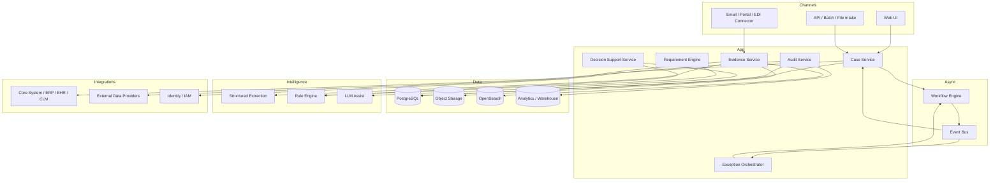

# 銀行の法人KYC/オンボーディング / 04_architecture

## 1. アーキテクチャ原則
1. **Case-centric**: すべてをケース中心に組み立てる
2. **Human-in-the-loop**: 自動化ではなく判断支援を主軸に置く
3. **Audit-first**: 全判断は再現可能なログを持つ
4. **Integration-first**: 既存基幹システムと共存する
5. **Exception-native**: 例外処理を後付けにしない

## 2. 推奨技術スタック
説明可能性と監査証跡が最重要。Backend は Kotlin/Spring Boot、データ処理/外部スクリーング統合は Python、ワークフローは Temporal、ルール評価は DMN または明示ルールエンジン、ケースデータは PostgreSQL、証跡と提出物は object storage、検索は OpenSearch、グラフ照会は Neo4j/Neptune で所有構造や関連当事者を扱うと良い。

## 3. 参照アーキテクチャ

## 4. サービス分割
- **Case Service**: 案件の生成、状態管理、責任者管理
- **Requirement Engine**: 必要条件・SLA・分岐ルール算出
- **Evidence Service**: 提出物管理、抽出、完全性判定
- **Decision Support Service**: 推奨判断、理由表示、根拠束ね
- **Exception Orchestrator**: 例外優先順位付け、エスカレーション
- **Audit Service**: 証跡、監査、説明責任
- **Integration Adapters**: 外部システム接続

## 5. データ設計方針
- 取引データは正規化されたRDBで保持
- 文書・画像・原本は object storage
- 全文検索/類似検索/抽出後テキストは検索基盤へ
- KPI と業務分析は別 warehouse へ集約

## 6. セキュリティ・ガバナンス
- 行レベル/ケースレベル権限制御
- 署名付きアクセスURL
- PII/PHI/財務情報のマスキング
- 監査ログの改ざん防止
- モデル出力の versioning
- prompt / extraction / decision recommendation の保存

## 7. 非機能要件
- 可用性: 業務時間帯の高可用
- 追跡性: すべてのケースに traceId を付与
- 再処理性: ルール改定時にケース再評価可能
- 拡張性: コネクタ差し替え可能
- 国際化: 日付、通貨、言語、法域差異に対応可能

## 8. 導入順序
1. 最も高価な例外パターンを特定
2. その例外だけをケース化
3. 必要条件計算と不足検知を実装
4. 推奨判断と根拠提示を実装
5. 下流連携を追加
6. KPI可視化と学習ループを載せる
